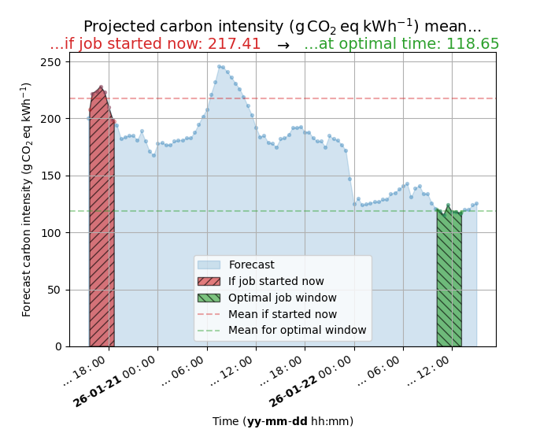

# CATS: **C**limate-**A**ware **T**ask **S**cheduler

CATS is a **C**limate-**A**ware **T**ask **S**cheduler. It schedules cluster jobs to minimize predicted carbon intensity of running the process. It was created as part of the [2023 Collaborations Workshop](https://software.ac.uk/cw23).

The Climate-Aware Task Scheduler is a lightweight Python package designed to schedule tasks based on the estimated carbon intensity of the electricity grid at any given moment. This tool uses real-time carbon intensity data from the National Grid ESO via their API to estimate the carbon intensity of the electricity grid, and schedules tasks at times when the estimated carbon intensity is lowest. This helps to reduce the carbon emissions associated with running computationally intensive tasks, making it an ideal solution for environmentally conscious developers.

*Demo showing CATS scheduling a 30 minute job using the `at` scheduler*


> [!NOTE]
> Currently CATS only works in the UK. If you are aware of APIs for realtime grid carbon intensity data in other countries please open an issue and let us know.

[](https://doi.org/10.21105/joss.08251)

## Features

- Estimates the carbon intensity of the electricity grid in real-time
- Schedules tasks based on the estimated carbon intensity, minimizing carbon emissions
- Provides a simple and intuitive API for developers
- Lightweight and easy to integrate into existing workflows
- Supports Python 3.9+

## Brief example with plot to illustrate

To find the minimal carbon intensity window for a 3 hour (`180` minute duration) job running
at the `RG1` postcode and show visually the carbon intensity curve and optimal window with
the `--plot` argument:

```console
$ cats --duration 180 --location "RG1" --plot
...

The.____ ..... __ .... ________ . ______...
.. /  __)...../  \....(__    __).)  ____)....
..|  /......./    \......|  |...(  (___........
..| |limate./  ()  \ware.|  |ask.\___  \cheduler
..|  \__...|   __   |....|  |....____)  )....
...\    )..|  (..)  |....|  |...(      (..


Best job start time                       = 2026-01-22 10:10:31
Carbon intensity if job started now       = 217.41 gCO2eq/kWh
Carbon intensity at optimal time          = 118.65 gCO2eq/kWh
```

which produced at the time run (`Tue 20 Jan 15:40:21 GMT 2026`) a forecast minimum of
`118.65 gCO2eq/kWh` for job start time `2026-01-22 10:10:31` as reported in the STDOUT above and
illustrated by the resulting plot of:



## Installation

Install via `pip` as follows:

```bash
pip install climate-aware-task-scheduler
```

To install the development version:

```bash
pip install git+https://github.com/GreenScheduler/cats
```

## Documentation

Documentation is available at https://cats.readthedocs.io

We recommend the
[quickstart](https://greenscheduler.github.io/cats/quickstart.html#basic-usage)
if you are new to CATS. CATS can optionally [display carbon footprint
savings](https://greenscheduler.github.io/cats/quickstart.html#displaying-carbon-footprint-estimates)
using a [configuration file](cats/config.yml).

## Contributing

We welcome contributions from the community! If you find a bug or have an idea for a new feature, please open an issue on our GitHub repository or submit a pull request.

## License

[MIT License](https://github.com/GreenScheduler/cats/blob/main/LICENSE)
