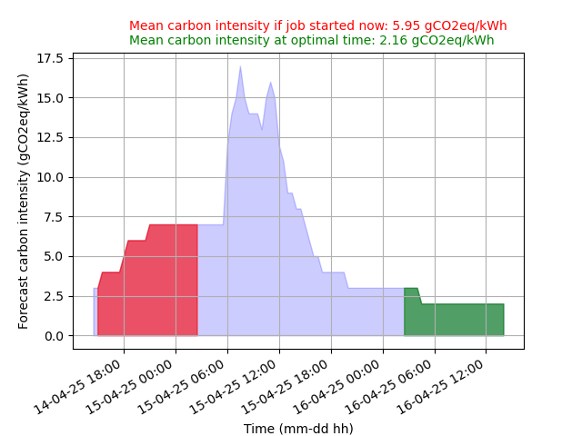

# Summary
The environmental impact of research computing is increasingly a topic of concern for researchers. One of the main contributors of compute-related greenhouse gas (GHG) emissions is the production of electricity to power digital research infrastructures (DRIs). The carbon footprint per unit of electricity consumption (called carbon intensity) depends mostly on the grid's energy mix, i.e., the share of renewable vs. high-carbon production methods, which varies greatly with time and location. Here, we describe the Climate Aware Task Scheduler (CATS), which lets researchers schedule computing when low-carbon electricity is available. CATS leverages carbon intensity forecasts, e.g., from power grid operators, to find the best window of time to run a particular job with minimal climate cost. CATS also provides an assessment of the carbon savings due to delaying compute as opposed to running it immediately. We demonstrate how the tool benefits researchers in the UK using forecasts of the National Grid's regional carbon intensity.

# Statement of need

The climate impact of research computing, computer science, and computational science is hard to overstate. Computing impacts the environment in many ways, from water and abiotic resource usage to GHG emissions to energy consumption and electronic waste. For many researchers, the CO$_2$e (CO$_2$-equivalent, the usual metric of carbon footprint aggregating the main GHGs) cost associated with running their models is larger than that of any other aspects of their life [@PortegiesZwart_2020]. The global carbon footprint of data centres is estimated at 126 Mt CO$_2$e [@Malmodin2024], equivalent to the entire American commercial aviation sector, and individual computing projects can reach dozens, if not hundreds, of tonnes of CO$_2$e [@PortegiesZwart_2020; @GrealeyLannelongue2022; @Luccioni_Viguier_Ligozat_2022]. This is becoming clear to researchers and funders, who are exploring different approaches to reducing and accounting for the climate impact of the research they commission [@Weber_2024; @Juckes23; @Lannelongue_Fropier_Matencio_2025]. There is a clear need to provide tools for motivated researchers to minimise the detrimental contribution of their research on the climate emergency, and to educate researchers around this impact.

There are several approaches that have been proposed and/or implemented to reduce the carbon footprint of computing, which are summarised in The Turing Way [@TuringWay] and in the CATS documentation. One of these is time shifting the computation such that it runs when the power supplied by the local electricity grid is dominated by renewable generation such as on windy or sunny days rather than periods where legacy fossil fuel generation dominates. The potential impact of minimally-invasive time-shifting approaches has been shown to result in significantly reduced carbon footprints [27% in one AI benchmark @Dodge2022]. CATS helps researchers timeshift their own computation such that it is scheduled when the forecast carbon intensity of the power grid is minimised. This timeshifting approach has been applied in the cloud [@Wiesner2021], for large-language model training [@Jagannadharao2025], and to take account of carbon intensity when scaling Kubernetes workloads on Azure [@Norlander], but we are not aware of a similar user facing tool. 

# Approach and functionality

At its core CATS is an open-source (MIT licence) Python package (tested with Python 3.9-3.12) that combines data on the forecast carbon intensity of the local electricity supply with information about a proposed job's duration to assess the best start time of the computation within the validity interval of the forecast. Users typically interact with CATS via a command-line interface targeting the UNIX Shell (CATS is tested on Linux and MacOS) and the best start time can be provided in an informative format (that the user can then use with their infrastructure) or in a way that can be passed on to job schedulers to set the calculation start time. CATS is available via the Python Package Index (PyPI) and can be installed along with its handful of dependencies into a Python environment with pip. Development takes place on GitHub (<https://cats.readthedocs.io/>) and documentation, including a fuller description of the approach, is available (<https://greenscheduler.github.io/cats/>).

The user provides CATS with the duration of the proposed computation on the command line. They may also provide the location, the command to run and information about the scheduler. CATS then accesses a prediction of the carbon intensity of the relevant power distribution network and computes the start time that minimises the carbon intensity over the duration of the computation. An illustration of this calculation is provided in Figure 1. Once the carbon intensity minimisation has been completed, CATS can optionally submit the computation to a queueing system or make a more detailed report on the climate impact of the proposed computation.

Providing further information about the carbon cost of the proposed computation improves the educational impact of CATS. This can be optionally enabled if information about the compute hardware is available. This calculation follows that used by the Green Algorithms project [@Lannelongue21], which also provides some easy to understand “equivalent” statements to put these numbers in context. 

# Limitations and future work

While by itself, CATS is unlikely to drastically reduce the carbon footprint of research computing, it addresses a "low-hanging fruit" of the issue and empowers researchers to adapt their practices. The approach is likely to work best on DRIs that are not fully utilised and where all users are willing to collaborate to move computation to times of lower carbon intensity. It is important to note that CATS does not account for the embodied costs of computer manufacture which, for laptops or desktop machines, can amount to 50-70% of their lifecycle carbon footprint [@Lannelongue_Vegad_Dorn_2024; @MacBookPro]. However, CATS is a tool that has been designed to be conceptually simple and user-friendly with the aim to encourage research groups to discuss the carbon cost of their computation and be a useful testbed for more complex approaches that may be applied on larger machines. To this end, we are investigating methods to make use of the same carbon intensity data used by CATS to allow batch queueing systems to include the target of minimising the climate cost of computation as part of the scheduling algorithm.

# Acknowledgments

We are grateful to the staff of the Software Sustainability Institute and the organisers of
Collaborations Workshop 2023 (CW23), whose efforts allowed us to enjoy the process of beginning the development of CATS as part of the CW23 Hack Day, and to others who contributed to the development via bug reports, questions, and the other contributions that help open-source software evolve. The author list is in alphabetical order. This work has been supported by the Software Sustainability Institute EPSRC, BBSRC, ESRC, NERC, AHRC, STFC and MRC (EP/S021779/1) and UKRI (AH/Z000114/1) grants.

# References
