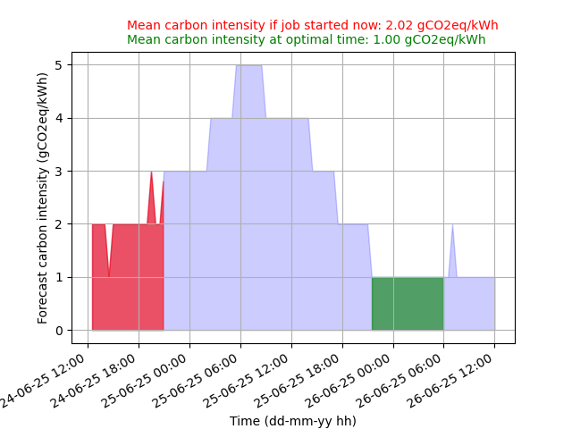

# Summary
The environmental impact of research computing is increasingly a topic of concern for researchers.
One of the main contributors of compute-related greenhouse gas emissions is the production of
electricity to power digital research infrastructures. The carbon footprint of electricity consumption 
(called carbon intensity), related to the energy mix (i.e. the share of renewable vs high-carbon 
production methods), varies greatly depending on time and location.  Here, we describe the Climate 
Aware Task Scheduler (CATS). CATS is designed to let researchers schedule computing when low-carbon 
electricity is available by using carbon intensity forecasts from the power supply network local to 
the computational resource they are using and thus reduce the climate cost of the computation. CATS 
also provides an assessment of the carbon savings due to delaying compute (vs compute happening now).

# Statement of need

The climate impact of research computing, computer science, and computational science is hard to 
understate. For many researchers, the CO$_2$ cost associated with running their models is larger 
than that of any other aspects of their life *(can this be referenced?)*. Furthermore, the CO$_2$ 
cost of computing is the largest component of the carbon budget of most computationally demanding  
projects *REF*. This is becoming clear to researchers and funders, who are exploring different 
approaches to reducing and accounting for the climate impact of the research they commission
[@Juckes23] *OTHERREFS*. There is a clear need to provide tools for motivated researchers to minimise the impact of 
their research on the climate emergency, and to educate researchers around this impact.

There are several approaches that have been proposed and/or implemented to reduce the carbon footprint of computing. These include interventions in procurement to maximise the useful life of computer hardware and thus reduce the embodied carbon cost, exercises in code modification to reduce the carbon cost of a particular calculation (mostly by shortening the runtime), modifying default settings to reduce carbon use (e.g. the clock frequency on ARCHER2, the UK national supercomputer, is now lower by default, [@Jackson23]) and attempts to improve data centre efficiency *REF*. However, many of these can be difficult for individual researchers to implement. One easier-to-implement approach is to make use of lower carbon intensive electricity to power the computation. This can be achieved either by shifting the computer to a part of the world where electricity is generated using renewable means (e.g. the University of York in the UK have located the latest institutional computing resource in Sweden *REF- York https://www.york.ac.uk/it-services/about/projects/viking/*), or by time shifting the computation such that it runs when the power supplied by the local electricity grid is dominated by renewable generation (e.g. on windy or sunny days) rather than periods where legacy fossil fuel generation dominates. The potential impact of this time-shifting approach has been studied with reference to the training of large language models, suggesting that XXX *REF*. CATS takes this approach on a smaller scale, helping researchers timeshift their own computation such that it is scheduled when the forecast carbon intensity of the power grid is minimised. 

It turns out that the information needed to sensibly timeshift computation to make use of reduced carbon intensity electrical power is also a powerful source of data for user education. Because CATS estimates the expected duration of the calculation and the expected carbon intensity, it is relatively easy to calculate the expected total saving in carbon intensity and, with some additional information about the computer hardware, the expected climate cost of the calculation and reduction achieved by timeshifting (both expressed in UNITS). This calculation follows that used by the green algorithms project [@Lannelongue21], which also provides some easy to understand “equivalent” statements to put these numbers in context (e.g. GIVE EXAMPLE).

As implemented, CATS is probably best used for small scale computing, maybe for a research group workstation or server which is used intermittently. Its use is thus unlikely to dramatically decrease the total climate impact of computational research. However, we hope that a tool like CATS provides a useful starting point for researchers to begin to think about the choices they make and the ways they can change their practice to reduce the impact of their research on the climate. At the end of this paper we discuss some of the other approaches that this knowledge could enable.

# Approach and functionality

At its core CATS is an open source (MIT licence) python package (tested with python 3.9-3.12) that combines data on the forecast carbon intensity of the local electricity supply with information about a proposed computation to assess the best start time of the computation within the validity interval of the forecast. Users typically interact with CATS via a command line interface targeting the UNIX Shell (CATS is tested on Linux and MacOS) and the best start time can be provided in an informative format designed to be consumed directly by the user or in a way that can be used to set the calculation start time within job scheduling software. CATS is available via the python package index (pypi) and can be installed along with its handful of dependencies into a python environment with pip. Development takes place on github (url) and documentation is available at (url).

At a minimum, the user must provide CATS with the duration of the proposed computation on the command line and CATS also requires information about the location where the computation is to happen (this can be provided on the command line, via a configuration file, or from geolocation of the IP address). This is sufficient information for CATS to access a prediction of the carbon intensity of the relevant power distribution network which is used to compute the start time that minimises the carbon intensity over the duration of the computation.

By default CATS makes use of 48 hour forward predictions published by National Grid Electricity System Operator Limited for regional distribution networks making use of a parameterisation of the power distribution system in Great Britain, weather forecasts and historical generation data. A brief overview of the forecast methodology can be found in [@Bruce21a; @Bruce21b] and the forecast, in the form of estimated carbon intensity at the end of each half hour period, is available via a web API (see url). CATS caches requests for this data to avoid repeated requests within the thirty minute time frame of a single forecast. We have designed CATS to to extract carbon intensity forecast data from other sources with very little modification. However, to date we are unaware of any publicly accessible forecasts of carbon intensity for other regional, national or transnational electricity distribution networks which means that the utility of CATS is restricted to locations within Great Britain.

With the carbon intensity forecast and duration of the proposed computation in hand the next task is to locate the start time (within the valid forecast period) that minimises the integrated carbon intensity over a sliding window equal to the duration. All else being equal, this minimising start time is the time when the carbon cost of the proposed computation will be least. The difference in the integrated carbon intensity between an optimal start time and starting the calculation immediately is a measure of the potential benefits of timeshifting the computation. An illustration of this calculation is provided in Figure 1. Once the carbon intensity minimisation has been completed, CATS can optionally submit the computation to a queueing system or make a more detailed report on the climate impact of the proposed computation.

Submitting the computation to a queueing system is relatively straightforward and is most clearly illustrated by using the veritable `at` program available on most Linux and MacOS systems. The `at` program “queues jobs for later execution” and, assuming the user provides the command to run their computation and any necessary arguments (using the CATS `--command` option), it is relatively simple to schedule the computation to run at the optimal time by running `at` with the right arguments. We note that the options for the time syntax for `at` on different systems are mutually incompatible, so CATS restricts itself to the POSIX compatible time format. CATS also supports job submission to other queuing systems such as slurm. 

We imagine that providing further information about the carbon cost of the proposed computation improves the educational impact of CATS. This can be enabled with the `--footprint` command line option. To provide this footprint information CATS must be configured with information about the hardware (principally the per-core power consumption of the processors) via “profiles” in the configuration file. Different profiles can allow for different classes of computation (for example, one that only uses the cpu, or one that uses the CPU and an attached GPU). This information, together with the grid carbon intensity and job duration, allows the total power consumption of the computation to be estimated along with the implied CO2 cost if it were to be run now, or if the start time were to be delayed to minimise the carbon intensity. This estimate is computed following REF - green algorithms project? before being reported. In addition, this information can be included in graphical output.

# Limitations and future work

By itself, CATS is unlikely to make a significant difference in the climate cost of computation. The approach is likely to work best on computers that are not fully utilised and where all users are willing to collaborate to move computation to times of lower carbon intensity. In addition, CATS does not account for the embodied costs of computer manufacture which, for desktop machines, can amount to XX% of the total carbon emissions associated with their use (ref). However, CATS is a relatively simple tool that can be used to encourage research groups to discuss the carbon cost of their computation, and is a useful test-bed for more complex approaches that may be applied on larger machines. To this end, we are investigating methods to make use of the same carbon intensity data used by CATS to allow batch queueing systems to include the target of minimising the climate cost of computation as part of the scheduling algorithm.

# Acknowledgments

We are grateful to the staff of the Software Sustainability Institute and the organizers of
Collaborations Workshop 2023 (CW23), who's efforts allowed us to enjoy the process of beginning the development of CATS as part of the CW23 Hack Day, and to others who contributed to the development of CATS via bug reports, questions, and the other contributions that help open source software evolve. This work has been supported by the Software Sustainability Institute EPSRC, BBSRC, ESRC, NERC, AHRC, STFC and MRC (EP/S021779/1) and UKRI (AH/Z000114/1) grants.

# References
