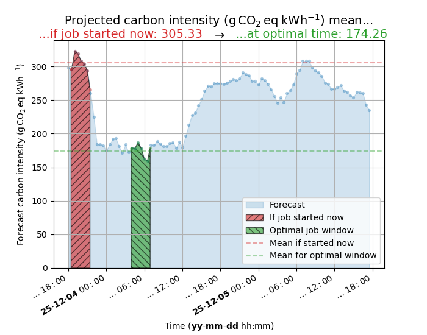

.. _quickstart:

Quickstart
==========

Basic usage
-----------

You can run CATS with:

.. code-block:: console
   :caption: *A basic command to run CATS when a job duration and postcode
              are provided.*

   $ cats --duration 480 --location "EH8"
   ...

   The.____ ..... __ .... ________ . ______...
   .. /  __)...../  \....(__    __).)  ____)....
   ..|  /......./    \......|  |...(  (___........
   ..| |limate./  ()  \ware.|  |ask.\___  \cheduler
   ..|  \__...|   __   |....|  |....____)  )....
   ...\    )..|  (..)  |....|  |...(      (..

   Best job start time                       = 2026-01-22 01:43:27
   Carbon intensity if job started now       = 43.23 gCO2eq/kWh
   Carbon intensity at optimal time          = 1.66 gCO2eq/kWh

The ``--location`` option is optional, and can be pulled from a
configuration file (see :ref:`configuration-file`), or inferred using
the server's IP address.

The ``--duration`` option indicates the expected job duration in
minutes.

The scheduler then calls a function that estimates the best time to start
the job given predicted carbon intensity over the next 48 hours. The
workflow is the same as for other popular schedulers. Switching to CATS
should be transparent to cluster users.

It will display the time to start the job on standard out and optionally
some information about the carbon intensity on standard error.

.. _locations-outside-gb:

Locations outside Great Britain
-------------------------------

The default behavior of CATS is to use carbon intensity forecast data provided
by the National Energy System Operator (NESO), which manages the electricity grid in
Great Britain (Northern Ireland uses a separate grid operating across
the island of Ireland). In order to use CATS for locations across Europe
it is possible to specify a different experimental data source provided by
the https://wattnet.eu/ project. This provides data at coarser spatial resolution
(approximately 60 zones across Europe including one representing Great Britain
compared to 14 areas provided by the NESO) but at finer time resolution (15
compared to 30 minutes) and for a longer duration (72 hours rather than 48 hours).
To use https://wattnet.eu/ the `--location` argument **must** be provided and must be the
name of a zone. In addition the `--api` argument needs to have the value "wattnet.eu"
and your personal wattnet password and email address combination must be provided via
environment variables. See https://docs.wattnet.eu for details on registering for an
account and obtaining these credentials. The example above is thus changed to:

.. code-block:: console
   :caption: *A basic command to run CATS using wattnet data.*

   $ export CATS_WATTNET_EMAIL=example@example.com
   $ export CATS_WATTNET_PASSWORD=a-password-for-wattnet
   $ cats --duration 480 --location GB --api wattnet.eu
   ...

   The.____ ..... __ .... ________ . ______...
    .. /  __)...../  \....(__    __).)  ____)....
    ..|  /......./    \......|  |...(  (___........
    ..| |limate./  ()  \ware.|  |ask.\___  \cheduler
    ..|  \__...|   __   |....|  |....____)  )....
    ...\    )..|  (..)  |....|  |...(      (..

    Best job start time                       = 2026-08-28 09:17:29
    Carbon intensity if job started now       = 146.84 gCO2eq/kWh
    Carbon intensity at optimal time          = 96.39 gCO2eq/kWh

The best start time from wattnet may not match the best start time from NESO's
service. All other arguments below are supported by both providers, and it
may be instructive to plot the forecasts.

Multi-metric providers: cost and renewable share
---------------------------------------------------

Beyond carbon intensity, several providers can serve more than one metric
from the same underlying API portal. Which metric to request is selected
with ``--metric``; each provider has a default so existing commands that
never pass ``--metric`` keep working unchanged. Run ``cats --list-providers``
at any time to see each provider's supported metrics and its default (see
:ref:`listing-providers` below).

``energy-charts.info`` (continental Europe, excluding Great Britain) and
``octopus.energy`` (Great Britain) serve day-ahead electricity **price**
(the default metric for both), letting CATS schedule jobs to minimise
electricity *cost* instead of carbon. Both are free and require no
authentication. Lower price is treated as "better", the same way lower
carbon intensity is, so no other arguments change:

.. code-block:: console
   :caption: *Using energy-charts.info for cost-aware scheduling in Germany/Luxembourg.*

   $ cats --duration 180 --location DE-LU --api energy-charts.info
   ...

   Best job start time                       = 2026-09-29 21:00:00
   Day-ahead electricity price if job started now       = 89.40 EUR/MWh
   Day-ahead electricity price at optimal time          = 80.34 EUR/MWh

.. code-block:: console
   :caption: *Using octopus.energy for cost-aware scheduling in Great Britain (region C, London).*

   $ cats --duration 180 --location C --api octopus.energy
   ...

   Best job start time                       = 2026-09-29 21:00:00
   Day-ahead electricity price if job started now       = 163.64 GBP/MWh
   Day-ahead electricity price at optimal time          = 135.21 GBP/MWh

The same two providers also serve a ``renewables`` metric: the share of
electricity generation that is renewable. Maximising renewable share does
not always coincide with minimising carbon intensity (nuclear generation is
low-carbon but not renewable) or price, which is what makes it a genuinely
different scheduling signal. ``carbonintensity.org.uk`` (Great Britain) also
serves ``renewables``, derived from the same regional API response it
already fetches for ``carbon`` - no extra API call is needed. All three
report **non-renewable share** rather than renewable share directly (100
minus the renewable percentage), so that "lower is better" still holds and
no changes were needed to the scheduler itself:

.. code-block:: console
   :caption: *energy-charts.info's renewables metric, for Germany.*

   $ cats --duration 180 --location de --api energy-charts.info --metric renewables
   ...

   Best job start time                       = 2026-09-29 19:39:41
   Non-renewable share if job started now       = 41.09 %
   Non-renewable share at optimal time          = 31.42 %

.. code-block:: console
   :caption: *carbonintensity.org.uk's renewables metric, for a GB postcode.*

   $ cats --duration 180 --location OX1 --api carbonintensity.org.uk --metric renewables
   ...

   Best job start time                       = 2026-09-30 04:39:41
   Non-renewable share if job started now       = 47.70 %
   Non-renewable share at optimal time          = 28.83 %

Note this value can occasionally go negative for the ``energy-charts.info``
provider: renewable generation can briefly exceed 100% of domestic load
around midday in high-solar/wind countries (the surplus is exported), which
is real data, not a bug, and still scores correctly (more negative is still
"better"). ``uk`` is a country code the underlying API accepts but has no
real data for; use ``carbonintensity.org.uk --metric renewables`` for Great
Britain instead.

``--footprint`` has no effect with any of the price or renewables metrics,
since it is specific to the ``Carbon intensity`` metric.

Sustainability metrics from wattnet.eu
-----------------------------------------

``wattnet.eu`` (see :ref:`locations-outside-gb` above) serves four metrics
from three separate endpoints of its own API, confirmed live against the
real service: ``carbon`` (the default; the carbon intensity metric
described above), ``water`` (life-cycle water footprint, in L/kWh),
``water_stress`` (water-stress-weighted footprint, in stress-L/kWh -
accounts for local water scarcity rather than plain volume), and
``environmental_score`` (wattnet's own composite score, where higher is
better; CATS negates it so that lower is better, like every other metric CATS reports).

.. code-block:: console
   :caption: *wattnet.eu's water metric, for Germany.*

   $ cats --duration 180 --location DE --api wattnet.eu --metric water
   ...

   Best job start time                       = 2026-09-30 10:24:43
   Water footprint if job started now       = 18.10 L/kWh
   Water footprint at optimal time          = 11.24 L/kWh

Trading off multiple signals with the composite provider
-------------------------------------------------------------

Rather than optimising for a single signal, CATS can optimise a weighted
trade-off between any combination of them, via the ``composite`` provider.
Its location can be either a GB postcode outward code (e.g. ``OX1``) or a
wattnet.eu zone code (e.g. ``DE``, ``IT_NORTH``); which kind is detected
automatically. For each requested signal, ``composite`` then picks whichever
portal natively serves it for that kind of location:

- for a GB postcode: ``carbon`` and ``renewables`` from
  ``carbonintensity.org.uk``, ``price`` from ``octopus.energy`` (region
  letter derived from the postcode automatically);
- for a wattnet.eu zone: ``carbon`` from ``wattnet.eu``, ``price`` and
  ``renewables`` from ``energy-charts.info`` (zone/country derived from the
  wattnet.eu zone; not every zone has an equivalent for these two).

``water``, ``water_stress`` and ``environmental_score`` only ever
come from ``wattnet.eu``. For a wattnet.eu zone location they use that zone
directly; for a GB postcode they fall back to wattnet.eu's single ``GB``
zone instead (wattnet's GB coverage is not postcode-granular), and CATS
prints a warning noting the substitution. This fallback needs the same
``CATS_WATTNET_EMAIL``/``CATS_WATTNET_PASSWORD`` environment variables as
``wattnet.eu`` itself, even when the rest of a GB postcode request (carbon,
price, renewables) does not.

Each selected signal's series is independently min-max normalised to a 0-1
scale over the fetched forecast window, then combined into a single score.

Which signals to combine, and their relative weight, is controlled with the
repeatable ``--signal NAME=WEIGHT`` option (valid names: ``carbon``,
``price``, ``renewables``, ``water``, ``water_stress``,
``environmental_score``; weights don't need to sum to 1, they are
normalised automatically):

.. code-block:: console
   :caption: *Combining carbon and renewables only, equally weighted, for a
              GB postcode.*

   $ cats --duration 180 --location OX1 --api composite --signal carbon=0.5 --signal renewables=0.5
   ...

   Best job start time                       = 2026-09-30 10:59:06
   Composite score (carbon=0.50, renewables=0.50) if job started now       = 0.20 0-1, lower=better
   Composite score (carbon=0.50, renewables=0.50) at optimal time          = 0.03 0-1, lower=better

.. code-block:: console
   :caption: *Combining wattnet.eu's environmental_score with price, for a
              GB postcode: environmental_score falls back to wattnet.eu's
              'GB' zone, with a warning noting the substitution.*

   $ cats --duration 180 --location OX1 --api composite --signal environmental_score=0.5 --signal price=0.5
   WARNING:root:'OX1' has no environmental_score data source; using wattnet.eu's 'GB' zone instead (needs wattnet.eu credentials).
   ...

   Best job start time                       = 2026-09-29 15:35:47
   Composite score (environmental_score=0.50, price=0.50) if job started now       = 0.38 0-1, lower=better
   Composite score (environmental_score=0.50, price=0.50) at optimal time          = 0.38 0-1, lower=better

With no ``--signal`` given at all, every signal available for that location
that needs no *extra* authentication is combined with equal weight. For a GB
postcode that is always ``carbon``, ``price`` and ``renewables`` (the three
``water``/``water_stress``/``environmental_score`` signals need
explicit ``--signal``, since they need wattnet.eu credentials the rest of a
GB postcode request does not). For a wattnet.eu zone it is every signal that
has a source at all for that zone (wattnet.eu credentials are already
required there, for ``carbon``); not every wattnet.eu zone has an
``energy-charts.info`` price or renewables equivalent (see
``WATTNET_TO_ENERGYCHARTS_ZONE`` and
``_wattnet_zone_to_renewables_country`` in ``cats/providers/composite.py``
for the details), so those zones are silently combined using only the
signals that *are* available. Explicitly requesting an unavailable signal
with ``--signal``, on the other hand, raises a clear error rather than
silently dropping it. As with the plain price and renewables providers,
``--footprint`` has no effect with the composite provider.

A handful of codes are valid both as a GB postcode outward code and as a
wattnet.eu zone code (``SE1``-``SE4``: South East London postcodes and
Swedish wattnet.eu price zones); the GB postcode interpretation always wins
in that case.

Constraining, rather than optimising for, price
-------------------------------------------------

Blending ``price`` into a weighted composite score (as above) still lets
price dominate the schedule if given enough weight, which drifts away from
CATS' climate-aware purpose. For a safer default, CATS can instead treat
price as a hard **constraint** on top of whichever metric is actually being
optimised (``carbon``, ``renewables``, ``environmental_score``, a
non-price composite blend, ...): keep optimising for that metric, but only
consider job start times whose price does not exceed a cap.

``--max-price-increase-pct N`` caps price at N% above running the job right
now; ``--max-price N`` caps it at an absolute value (GBP/MWh for a GB
postcode, EUR/MWh for a wattnet.eu zone). They are mutually exclusive, and
work with *any* provider or metric, not just ``composite`` - price is
fetched for the location independently of what is actually being optimised:

.. code-block:: console
   :caption: *Optimise for carbon, but never accept a price increase over
              running the job right now, for a GB postcode.*

   $ cats --duration 60 --location OX1 --api carbonintensity.org.uk --max-price-increase-pct 0
   ...

   Best job start time                       = 2026-09-30 11:46:45
   Carbon intensity if job started now       = 72.71 gCO2eq/kWh
   Carbon intensity at optimal time          = 72.71 gCO2eq/kWh
   Price if job started now                  = 137.65 GBP/MWh
   Price at chosen start time                 = 137.65 GBP/MWh (- 0.00)

Without the ``--max-price-increase-pct`` constraint above, the same command
picks a genuinely lower-carbon window (64.01 gCO2eq/kWh) that happens to be
considerably *more* expensive (229.45 GBP/MWh, a saving of -91.80, i.e. a
price *increase*) - exactly the trade-off this feature exists to let you
control explicitly rather than accept implicitly.

If no candidate start time both satisfies the cap and falls within however
far ahead price data currently reaches (day-ahead prices are typically only
published a matter of hours to a couple of days ahead, often considerably
less than e.g. wattnet.eu's own 72 hour forecast horizon), CATS raises a
clear error rather than silently ignoring the constraint or picking an
unverified window.

Whether or not either flag is given, CATS also reports the price impact of
the chosen schedule whenever price data is available for the location (as
seen in the example above) - so you always see the cost consequence of an
environmental-metric-only optimisation, without price ever silently
influencing that optimisation itself. This report is only shown when price
data actually covers *both* the "now" and the chosen start time; if the
chosen window falls outside price data's current horizon, the report is
omitted entirely rather than showing a partial or misleading comparison.

.. _listing-providers:

Listing available providers
----------------------------

To see all registered providers, their coverage, their forecast properties
and (where relevant) their supported metrics and default, without needing
to also supply ``--duration``:

.. code-block:: console

   $ cats --list-providers
   carbonintensity.org.uk
       Provider for the National Energy System Operator's carbonintensity.org.uk API
       max duration: 2820 min, resolution: 30 min
       metrics: carbon (default), renewables
   composite
       Unified composite provider: picks the right portal per metric and location
       max duration: 1425 min, resolution: 30 min
   energy-charts.info
       Provider for the Fraunhofer ISE Energy-Charts API
       max duration: 2865 min, resolution: 15 min
       metrics: price (default), renewables
   octopus.energy
       Provider for the Octopus Energy Agile tariff API
       max duration: 2820 min, resolution: 30 min
       metrics: price (default)
   wattnet.eu
       Experimental provider for the wattnet.eu project API
       max duration: 4305 min, resolution: 15 min
       metrics: carbon (default), environmental_score, water, water_stress

.. _listing-locations:

Listing valid locations
-----------------------

Each provider uses its own location codes (GB postcode outward codes, GB region
letters, bidding zones, country codes or wattnet.eu zones), so ``--location``
values are not interchangeable between providers. To see the valid codes,
without needing ``--duration``:

.. code-block:: console

   $ cats --list-locations --api octopus.energy
   octopus.energy
     GB electricity distribution region letters
       A  East England
       B  East Midlands
       C  London
       ...

Use ``--api`` (or give the API name directly after ``--list-locations``) to list
a single provider, or omit it to list all of them.
Some providers use different codes per metric (``energy-charts.info`` takes
bidding zones for ``price`` and country codes for ``renewables``), so add
``--metric`` to restrict the listing:

.. code-block:: console

   $ cats --list-locations --api energy-charts.info --metric renewables

Illustration of estimate with ``--plot``
----------------------------------------

The optimal time to run the job can be illustrated with use of
the ``--plot`` argument, which also creates a plot of the carbon intensity
time series and highlights the window in time if the job was run now
compared to at the optimal time. For example:

.. code-block:: console
   :caption: *Use of ``--plot`` to perceive the carbon intensity curve and
              minimisation for the optimal window.*

   $ cats --duration 180 --location "RG1" --plot
   ...

   The.____ ..... __ .... ________ . ______...
   .. /  __)...../  \....(__    __).)  ____)....
   ..|  /......./    \......|  |...(  (___........
   ..| |limate./  ()  \ware.|  |ask.\___  \cheduler
   ..|  \__...|   __   |....|  |....____)  )....
   ...\    )..|  (..)  |....|  |...(      (..

   Best job start time                       = 2026-01-22 10:10:31
   Carbon intensity if job started now       = 217.41 gCO2eq/kWh
   Carbon intensity at optimal time          = 118.65 gCO2eq/kWh

The optimal window is where the area under the curve is minimised, as
highlighted in the plot ('Optimal job window'). The legend title shows the
absolute and percentage saving between the 'now' and 'optimal' means, for
whichever metric and unit the chosen provider returns (carbon intensity,
price, non-renewable share, or a composite score).

.. _configuration-file:

Using a configuration file
--------------------------

Information about location can be provided by a configuration file
instead of a command line arguments to the ``cats`` command.

.. code-block:: yaml

   location: "EH8"

Use the ``--config`` option to specify a path to the configuration
file, relative to the current directory.

In case of a missing location command line argument, ``cats`` looks
first in the ``CATS_CONFIG_FILE`` environment variable and if that
is not set it looks for a file named ``config.yml``
in the current directory.

.. code-block:: shell

   #  Override duration value at the command line
   cats --config /path/to/config.y(a)ml --location "OX1"

When ``--duration`` information is not provided via the option, and
location information is not provided in the YAML configuration file
specified or detected, CATS will try to estimate location from the
machine IP address:

.. code-block:: console

   $ cats --duration 480
   WARNING:root:config file not found
   WARNING:root:Unspecified carbon intensity forecast service, using carbonintensity.org.uk
   WARNING:root:location not provided. Estimating location from IP address: RG2.
   Best job start time 2024-08-22 07:30:49.800951+01:00
   Carbon intensity if job started now       = 117.95 gCO2eq/kWh
   Carbon intensity at optimal time          = 60.93 gCO2eq/kWh

Use --format=json to get this in machine readable format

.. code-block::console

   # location information is provided by the file
   # specified in $CATS_CONFIG_FILE
   # If not, it looks for ./config.yml
   # otherwise 'cats' errors out.
   export CATS_CONFIG_FILE=/path/to/config.yml
   cats --duration 480

Displaying carbon footprint estimates
-------------------------------------

CATS is able to provide an estimate for the carbon footprint reduction
resulting from delaying your job. To enable the footprint estimation,
you must provide the ``--footprint`` option, the memory consumption in GB
and a hardware profile:

.. code-block:: shell

   cats --duration 480 --location "EH8" --footprint --memory 8 --profile <my_profile>

The ``--profile`` option specifies information power consumption and
quantity of hardware the job using. This information is provided by
adding a section ``profiles`` to the :ref:`cats YAML configuration
file <configuration-file>`.

You can define an arbitrary number of profiles as subsection of the
top-level ``profiles`` section:

.. literalinclude :: ../../cats/config.yml
   :language: yaml
   :caption: *An example provision of machine information by YAML file
             to enable estimation of the carbon footprint reduction.*

The name of the profile section is arbitrary, but each profile section
*must* contain one ``cpu`` section, or one ``gpu`` section, or both.
Each hardware type (``cpu`` or ``gpu``) section *must* contain the
``power`` (in Watts, for one unit) and ``nunits`` sections. The ``model`` section is optional,
meant for documentation.

When running ``cats``, you can specify which profile to use for carbon
footprint estimation with the ``--profile`` option:

.. code-block:: shell

   cats --duration 480 --location "EH8" --footprint --memory 6.7 --profile my_gpu_profile

The default number of units specified for a profile can be overidden
at the command line:

.. code-block:: shell

   cats --duration 480 --location "EH8" --footprint --memory 16 \
        --profile my_gpu_profile --gpu 4 --cpu 1

.. warning::
   The ``--profile`` option is optional. If not provided, ``cats`` uses the
   first profile defined in the configuration file as the default
   profile.
